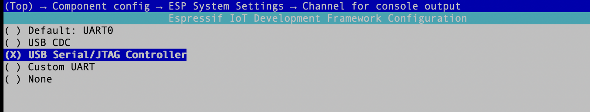
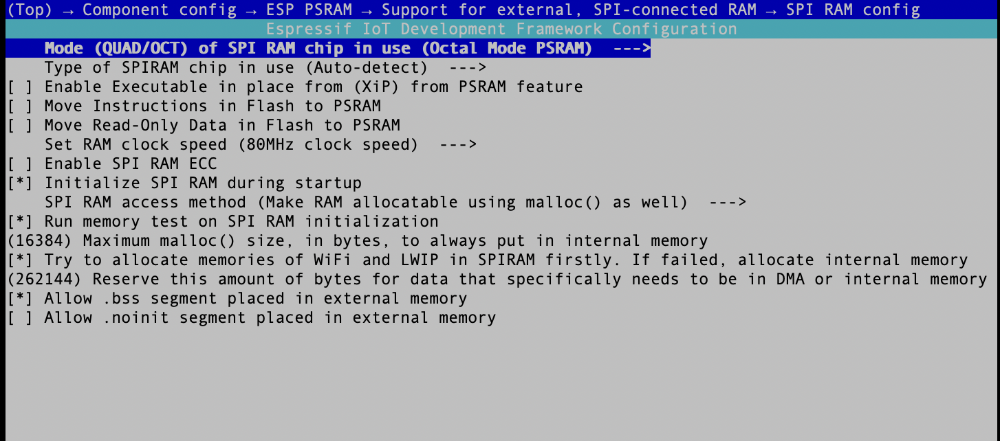

# Open RealtimeAPI Embedded SDK

# Table of Contents

- [Docs](#docs)
- [Installation](#installation)
- [Usage](#usage)

## Platform/Device Support

This SDK has been developed tested on a `esp32s3` and `linux`. You don't need any physical hardware
to run this SDK. You can use it from Linux directly.

To use it on hardware purchase either of these microcontrollers. Others may work, but this is what
has been developed against.

* [Freenove ESP32-S3-WROOM](https://www.amazon.com/gp/product/B0BMQ8F7FN)
* [Sonatino - ESP32-S3 Audio Development Board](https://www.amazon.com/gp/product/B0BVY8RJNP)

You can get a ESP32S3 for much less money on eBay/AliExpress.

## Installation

`protoc` must be in your path with `protobufc` installed.

Call `set-target` with the platform you are targetting. Today only `linux` and `esp32s3` are supported.
* `idf.py set-target esp32s3`
<!-- 
Configure device specific settings. None needed at this time
* `idf.py menuconfig`

Set your Wifi SSID + Password as env variables
* `export WIFI_SSID=foo`
* `export WIFI_PASSWORD=bar`
* `export OPENAI_API_KEY=bing`

Build
* `idf.py build`

If you built for `esp32s3` run the following to flash to the device
* `sudo -E idf.py flash`

If you built for `linux` you can run the binary directly
* `./build/src.elf`

See [build.yaml](.github/workflows/build.yaml) for a Docker command to do this all in one step. -->

## Usage

### For ReSpeaker Lite

1. Please do `idf.py menuconfig` to set the following setthings:




2. Run `idf.py build flash monitor` and plug the XIAO ESP32S3(with respeaker lite) to your PC

3. There will be a console output like this, please type your `OPENAI_API_KEY`, `WIFI_SSID` and `WIFI_PASSWORD` in the console:
```
Type 'help' to get the list of commands.
Use UP/DOWN arrows to navigate through command history.
Press TAB when typing command name to auto-complete.
E (773) cmd: Please set openai api key and wifi ssid and password via cmdline, then reboot!
SenseCAP> openai_api -k sk-***************************************
SenseCAP> wifi_sta -s your_wifi_ssid -p your_wifi_password
SenseCAP> reboot
```